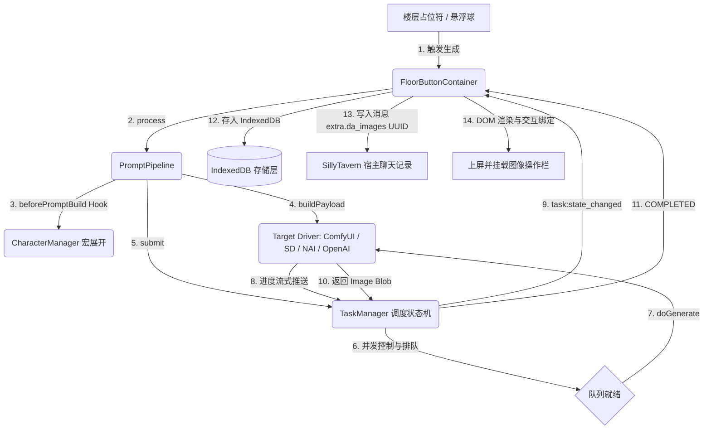

# ST-DrawAssistant 架构设计与核心逻辑链开发参考手册

> 本文档为 ST-DrawAssistant (Starlight DrawAssistant) 的核心技术架构规范与开发参考文档。记录了系统微内核设计、5 大核心数据逻辑链、四大生图驱动契约、UI 声明式架构以及反模式防范指引。

---

## 目录
- [ST-DrawAssistant 架构设计与核心逻辑链开发参考手册](#st-drawassistant-架构设计与核心逻辑链开发参考手册)
  - [目录](#目录)
  - [一、项目架构总览](#一项目架构总览)
  - [二、5 大核心数据流与逻辑链](#二5-大核心数据流与逻辑链)
    - [1. 通信架构与网络管道链](#1-通信架构与网络管道链)
    - [2. 任务调度状态机与并发队列链](#2-任务调度状态机与并发队列链)
    - [3. 提示词处理管线与扩展宏展开链](#3-提示词处理管线与扩展宏展开链)
    - [4. 楼层按钮交互与 DOM 生命周期链](#4-楼层按钮交互与-dom-生命周期链)
    - [5. 存储适配与内存生命周期闭环](#5-存储适配与内存生命周期闭环)
  - [三、四大后端生图驱动契约](#三四大后端生图驱动契约)
  - [四、UI 声明式组件与状态分层设计](#四ui-声明式组件与状态分层设计)
    - [1. 界面状态分层](#1-界面状态分层)
    - [2. CSS 样式规范与 BEM 命名](#2-css-样式规范与-bem-命名)
  - [五、扩展机制 (Extension System)](#五扩展机制-extension-system)

---

## 一、项目架构总览

ST-DrawAssistant 采用**微内核 + 插件扩展 (Microkernel Architecture)** 架构，整个工程解耦为五个核心层级：

```
┌─────────────────────────────────────────────────────────────────────────┐
│                           UI Layer (视图与交互层)                        │
│  - SettingsModal (侧边栏抽屉与 Tab 插槽宿主)                             │
│  - FloorButtonContainer (楼层按钮扫描注入与交互)                        │
│  - Media (ImageRenderer, ImageEditor, LightboxModal)                    │
│  - Controls (FormRenderer, LoraManager, PresetToolbar, Modal/Overlay)   │
└────────────────────────────────────┬────────────────────────────────────┘
                                     │ 调度与数据绑定
┌────────────────────────────────────▼────────────────────────────────────┐
│                         Domain Layer (领域逻辑层)                       │
│  - TaskManager (任务状态机、并发限制队列、Client-side Discard)            │
│  - PromptPipeline (提示词清洗、宏展开、拦截钩子 PipelineHooks)           │
│  - Drivers (ComfyUIDriver, SDWebUIDriver, NovelAIDriver, OpenAIDriver)  │
└────────────────────────────────────┬────────────────────────────────────┘
                                     │ 基础设施与状态容器
┌────────────────────────────────────▼────────────────────────────────────┐
│                          Core Layer (核心内核层)                        │
│  - KernelContext & ExtensionRegistry (微内核上下文与扩展服务总线)        │
│  - ObservableStore & SchemaMigrator (响应式单一事实源与配置平滑迁移)    │
│  - TypedEventBus & SillyTavernHostBridge (类型化事件总线与宿主契约桥接) │
│  - IndexedDBStorageAdapter (轻量化二进制媒体持久化存储)                │
└────────────────────────────────────┬────────────────────────────────────┘
                                     │ 扩展功能接入
┌────────────────────────────────────▼────────────────────────────────────┐
│                    Extensions Layer (特性扩展模块)                      │
│  - CharacterManager (角色管理、服装管理、模板宏替换引擎、插槽 Tab 注入) │
└─────────────────────────────────────────────────────────────────────────┘
```

---

## 二、5 大核心数据流与逻辑链



### 1. 通信架构与网络管道链
- **双模通信策略**：
  - **Pattern B (前端直连模式)**：面向本地 `127.0.0.1` 部署的 ComfyUI / SD-WebUI，利用浏览器回环地址豁免 Mixed Content 机制，提供极低延迟与零配置开箱体验；
  - **Pattern A (服务端代理模式)**：面向远程 HTTPS 宿主访问远程 HTTP 后端或需要隐藏商业密钥的场景，经由 SillyTavern 服务端插件（`/api/plugins/ST-DrawAssistant/proxy`）中转，杜绝跨源与混合内容阻断。
- **底层管道基类 (`BaseDriver`)**：
  - 封装统一的 `AbortController`，集成可配置的超时终止与用户主动取消；
  - 提供 `DriverError` 统一业务异常模型（区分 `AUTHENTICATION_ERROR`、`BACKEND_ERROR`、`TIMEOUT`、`NETWORK_ERROR`）。

### 2. 任务调度状态机与并发队列链
- **有限状态机 (FSM) 流转**：
  ```
  PENDING ──► RUNNING ──► COMPLETED
      │            │
      ▼            ▼
  CANCELLED    DISCARDED / ERROR
  ```
- **客户端丢弃机制 (Client-side Discard)**：
  - 针对 ComfyUI/SD-WebUI 无法精确根据任务 ID 撤回正在渲染任务的特性，用户取消时将 Task 标记为 `DISCARDED`，UI 立即复位；
  - 当异步生成的图像延时到达时，`TaskManager` 校验任务状态直接丢弃，不触发 `COMPLETED` 事件也不落库，保障状态机幂等性。
- **并发调度保护**：
  - 通过 `maxConcurrent` 控制最大并行任务数，在 `executeTask` 的 `finally` 块中始终执行队列推进，杜绝死锁。

### 3. 提示词处理管线与扩展宏展开链
- **分层处理管道 (`PromptPipeline`)**：
  1. `beforeClean` 钩子拦截；
  2. 提取正向提示词与负向提示词（以首个 `|` 字符分割）；
  3. `cleanPromptText` 规范化空行与多余逗号；
  4. `beforePromptBuild` 钩子（由 `CharacterManager` 介入展开角色外貌与服装预设宏）；
  5. 委托目标驱动根据引擎特性执行 `buildPayload`；
  6. `beforeSubmit` 提交前终态拦截。
- **ComfyUI 宏变量安全注入**：
  - `%steps%`、`%seed%`、`%width%`、`%height%` 等数值变量替换为纯数字；
  - `%prompt%`、`%negative_prompt%`、`%ckpt_name%` 等字符串变量通过 `JSON.stringify` 转义后再替换，防止特殊字符破坏 JSON 语法。

### 4. 楼层按钮交互与 DOM 生命周期链
- **DOM 挂载生命周期**：
  - 监听宿主 `CHARACTER_MESSAGE_RENDERED` 与 `MESSAGE_UPDATED` 事件，确保楼层正文进入 DOM 后再执行占位符扫描与按钮替换；
- **状态与网络解耦**：
  - 按钮仅维护 `default` | `loading` | `progress` | `done` | `error` 状态，完全由 `task:state_changed` 事件驱动，按钮自身不直接持有异步请求；
- **多版本 (Swipe) 隔离支持**：
  - 图像元数据按 `extra.da_images[swipe_id][buttonIndex]` 索引，多分支切换时自动恢复对应 swipe 的图像。

### 5. 存储适配与内存生命周期闭环
- **瘦身存储架构**：
  - 图像二进制统一存储在浏览器 `IndexedDB` 中；
  - SillyTavern 聊天记录中只保留轻量级索引元数据：
    ```json
    {
      "uuid": "550e8400-e29b-41d4-a716-446655440000",
      "mime": "image/webp",
      "prompt": "1girl, solo, masterpiece",
      "timestamp": 1704067200000
    }
    ```
- **Object URL 内存回收**：
  - 渲染新图像前主动 `URL.revokeObjectURL(oldUrl)`；
  - 视图注销（`dispose`）时遍历 `_trackedObjectUrls` 清空所有生成的临时 Blob URL。

---

## 三、四大后端生图驱动契约与能力矩阵

系统采用面向特性的驱动契约设计 (`DriverCapabilities`)，由各生图驱动显式声明自身支持能力：

```typescript
export interface DriverCapabilities {
    readonly supportsInterrupt: boolean;   // 是否支持即时打断生图任务
    readonly supportsInpaint: boolean;     // 是否支持局部重绘模式
    readonly supportsAssetSync: boolean;   // 是否支持从后端拉取模型与采样器列表
    readonly promptSyntax: 'wlr' | 'parentheses' | 'plain'; // 提示词权重格式
}
```

| 驱动实现 | 驱动标识 (`id`) | 打断支持 (`supportsInterrupt`) | 重绘支持 (`supportsInpaint`) | 资产同步 (`supportsAssetSync`) | 提示词语法 (`promptSyntax`) | 核心通信与特性 |
|---|---|:---:|:---:|:---:|:---:|---|
| **ComfyUIDriver** | `comfyui` | ✅ | ✅ | ✅ | `wlr` | WebSocket 阶段追踪，支持 API JSON 宏变量安全注入 |
| **SDWebUIDriver** | `sdwebui` | ✅ | ✅ | ✅ | `parentheses` | REST API 通信，支持二阶段高清修复与 `/sdapi/v1/interrupt` 打断 |
| **NovelAIDriver** | `novelai` | ❌ (Abort) | ❌ | ❌ | `plain` | 云端渲染，支持花括号语法转换、SMEA 增强采样与 ZIP 二进制解包 |
| **OpenAIDriver** | `openai` | ❌ (Abort) | ❌ | ❌ | `plain` | 自然语言提示词，支持 DALL-E 3 / Grok 及兼容中转接口 |

---

## 四、UI 声明式组件与状态分层设计

### 1. 界面状态分层
- **Draft Store (内存草稿状态)**：承载参数输入框与滑块等交互，实时响应修改而不污染持久化模板预设库；
- **Main Store (持久化中心)**：记录当前激活的方案 ID 与全局插件设置；
- **FormRenderer 声明式 Schema 引擎**：
  - 通过 `SectionCardSchema` 与 `FormRowSchema` 配置化输出标准化卡片；
  - 内置 `visibleWhen` 动态条件显隐与 `disabledWhen` 动态条件禁用（随后端模型与高级开关联动）；
  - 支持 `fromStore` / `toStore` 单位转换与 `headerExtra` 卡片操作插槽。

### 2. CSS 样式规范与 7 层模块化架构设计
- **CSS Token 统一**：颜色全部引用 `var(--da-*)` 主题变量，严格禁止硬编码非语义化色值；
- **语义化命名**：严格禁止面向视觉表象的类名（如禁止 `.da-close-red-dot`，统一采用 `.da-modal-close-btn`、`.da-status-indicator` 等语义化类名）；
- **7 层模块化架构与原生级联加载**：
  样式系统采用浏览器原生 `@import url()` 级联解析，由 `styles/main.css` 作为统一聚合入口，垂直划分为 7 大职责层级：
  1. `tokens/`：设计令牌与 `:root` 变量系统、命名空间根容器；
  2. `base/`：全局 Keyframes 动画关键帧与滚动条规范；
  3. `layout/`：弹窗骨架容器、标题栏、侧边栏、内容区、底部栏；
  4. `components/`：原子与组合控件（表单控件、开关、滑动条、按钮体系、卡片、取色器、预设栏、LoRA 管理器等）；
  5. `features/`：业务特性领域样式（画廊、存储大盘、蓝图编辑器、工作流诊断、局部重绘、灯箱、折叠器）；
  6. `views/`：视图级排版与大盘面板（关于页、诊断与实时终端页）；
  7. `skin/`：高优先级覆盖层（浅色模式 `[data-da-mode="light"]` 与响应式断点）。
- **静态样式沉淀**：所有布局、过渡、间距均沉淀至样式表对应模块中，TypeScript 逻辑中仅保留动态坐标与显隐切换。

---

## 五、扩展机制 (Extension System)

第三方扩展或内部模块（如 `character-manager` 与 `sample-addon`）通过实现 `IExtension` 接口无侵入接入核心系统：

```typescript
export interface IExtension {
    readonly id: string;
    readonly name: string;
    readonly version: string;
    readonly description?: string;
    activate(context: KernelContext): Promise<void> | void;
    deactivate(): Promise<void> | void;
}
```

### 1. 扩展内部标准分层模型
扩展模块内部推荐划分为 4 个清晰子域：
- **`domain/`**：核心业务模型、宏替换引擎与流水线适配钩子；
- **`data/`**：数据存取适配器与官方内置预设加载器；
- **`ui/`**：主面板 DOM 视图与工具栏控件适配；
- **`index.ts`**：门面入口，实现微内核 `IExtension` 契约。

### 2. 微内核协同
- **插槽 Tab 注入**：通过 `context.ui.registerTab(...)` 注册自定义配置面板；
- **生图管线拦截**：通过 `context.hooks.beforePromptBuild.tap(...)` 或 `beforeSubmit.tap(...)` 注册提示词流水线处理钩子。

